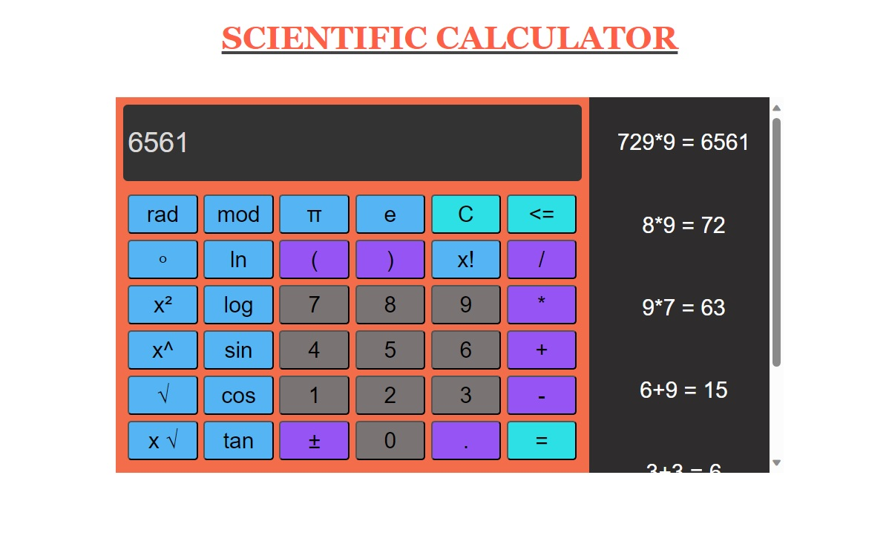

# Descripción 🌴
Pequeño proyecto donde utilizó **Javascript**, **HTML** and **CSS**; junto a **JQUERY** y otras cosas para hacer el proyecto más dinámico y responsivo

# Autor 😎
Jill Palma Garro

[LinkedIn](https://www.linkedin.com/in/jillpg) 

[Github](https://github.com/JPG24)

# Ejemplo

 

# Instalación 💻
No necesita ninguna instalación

# Contacto 📩
Si quieren contactarme, escríbanme a jpalmagarro@gmail.com

